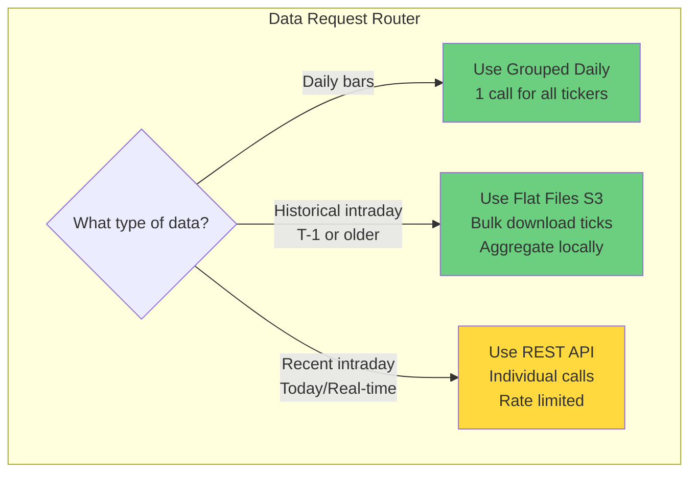

# ✅ Correct Optimization Strategy by Data Type

## You're Right - Grouped Daily ONLY Works for Daily Bars!

The Grouped Daily Bars API (`/v2/aggs/grouped/`) **only provides daily OHLC data**. It doesn't help with intraday/granular timeframes at all.

## Optimization by Timeframe

### 📊 Daily Bars (1d)
**✅ HUGE OPTIMIZATION AVAILABLE**
- **Current**: Individual API calls per ticker (10,000+ calls)
- **Optimized**: Grouped Daily Bars (1 call for entire market)
- **Efficiency**: 500-10,000x improvement

### ⏱️ Intraday Bars (1s, 5s, 1m, 5m, 15m, 30m, 1h, 2h, 4h)
**❌ NO GROUPED API AVAILABLE**
- **Current**: Individual REST API calls per ticker/timeframe
- **Problem**: Still requires thousands of API calls
- **Solution**: **FLAT FILES (S3)** for bulk historical intraday data

## The REAL Solution for Intraday Data

### Option 1: Flat Files (S3) - BEST for Historical
```python
# Download ALL trades/quotes for a day from S3
flat_files.download_day_data("2024-01-01")  # Gets raw tick data

# Then aggregate locally to any timeframe
aggregate_to_bars(tick_data, "1m")  # Create 1-minute bars
aggregate_to_bars(tick_data, "5m")  # Create 5-minute bars
aggregate_to_bars(tick_data, "15m") # Create 15-minute bars
```

**Pros:**
- No API rate limits (direct S3 download)
- Get ALL tickers' tick data in bulk
- Can generate ANY timeframe locally
- Perfect for historical data

**Cons:**
- Large file sizes (GBs per day)
- Need to aggregate locally
- Only available for historical (T-1 or older)

### Option 2: REST API - For Recent/Specific
```python
# Still need individual calls for recent intraday
for ticker in tickers:
    client.get_bars(ticker, "1m", start, end)  # Individual API call
```

**When to use:**
- Recent data (today/yesterday)
- Specific tickers only
- Real-time updates

## Corrected Optimization Strategy



## Realistic Efficiency Gains

| Data Type | Current Method | Optimized Method | Improvement |
|-----------|---------------|------------------|-------------|
| **Daily bars (all stocks)** | 10,000 REST calls | 1 Grouped Daily call | **10,000x** ✅ |
| **Historical intraday (all stocks, 1 year)** | 2.5M REST calls | Flat Files (S3) | **∞** (no API calls) ✅ |
| **Recent intraday (specific ticker)** | REST calls | REST calls | **No change** ❌ |
| **Recent intraday (all stocks)** | 10,000+ REST calls | Still 10,000+ REST calls | **No improvement** ❌ |

## So What CAN We Optimize?

### 1. ✅ Daily Bars - MASSIVE WIN
- Use Grouped Daily Bars
- 10,000x fewer API calls
- This alone is worth implementing

### 2. ✅ Historical Intraday - BIG WIN
- Use Flat Files for anything older than T-1
- Download raw ticks from S3
- Aggregate locally to any timeframe
- No API limits

### 3. ❌ Recent Intraday - LIMITED OPTIONS
- Still need individual REST calls
- Can optimize with:
  - Better caching
  - Smarter batching
  - Only downloading what changed
  - Using WebSocket for real-time instead of polling

## Example: Downloading 1 Year of Data

### Scenario: S&P 500 (500 stocks), All timeframes, 1 year historical

#### Current Approach (REST API for everything):
```python
# Daily: 500 stocks × 252 days = 126,000 calls
# 1min: 500 stocks × 252 days = 126,000 calls  
# 5min: 500 stocks × 252 days = 126,000 calls
# 15min: 500 stocks × 252 days = 126,000 calls
# 1hour: 500 stocks × 252 days = 126,000 calls
# TOTAL: 630,000 API calls!
# Time: 63,000 minutes = 1,050 hours = 43 days!
```

#### Optimized Approach:
```python
# Daily: 252 Grouped Daily calls (1 per day)
# Intraday: 252 Flat File downloads (1 per day)
#          Then aggregate locally to 1m, 5m, 15m, 1h
# TOTAL: 504 operations (252 API + 252 S3)
# Time: ~2-3 hours
```

#### Improvement: **1,250x fewer operations!**

## The Truth About Intraday Optimization

**There is NO grouped endpoint for intraday data.** Polygon doesn't offer a way to get all stocks' minute bars in one call. Your options are:

1. **For Historical**: Use Flat Files (best option)
   - Download raw ticks
   - Aggregate yourself
   - No rate limits

2. **For Recent**: Stuck with REST API
   - Individual calls per ticker
   - Rate limited
   - Use parallel workers wisely

3. **Alternative**: Consider if you really need all intraday
   - Maybe only track specific stocks intraday
   - Use daily for broad market coverage
   - Focus intraday on high-volume stocks

## Revised Implementation Priority

### Phase 1: Quick Wins
1. **Implement Grouped Daily** (only helps daily bars)
2. **Implement Flat Files** (helps historical intraday)

### Phase 2: Optimize What's Left
1. **Smart caching** for recent intraday
2. **Incremental updates** (only fetch new bars)
3. **WebSocket** for real-time (instead of polling)

### Phase 3: Architecture
1. **Hybrid router** choosing optimal source
2. **Local aggregation** engine for tick data
3. **Compression** and storage optimization

## Key Takeaway

- **Grouped Daily**: Amazing for daily bars (10,000x improvement) ✅
- **Flat Files**: Amazing for historical intraday (no API limits) ✅  
- **Recent Intraday**: Still challenging, no magic bullet ⚠️

The optimization is still massive, just not uniformly distributed across all data types!
